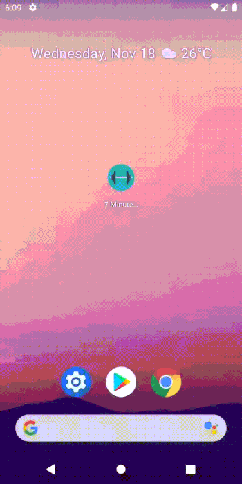
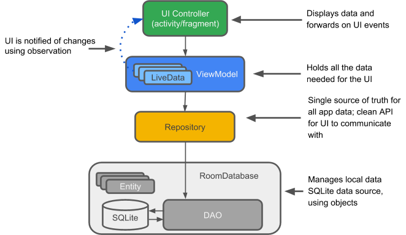

# 7 Minutes Workout
[](https://android-arsenal.com/api?level=21)
[](https://kotlinlang.org)
[](https://opensource.org/licenses/Apache-2.0)

Easy to use exercise workout app based on modern Android application tech-stacks and MVVM architecture.

## Features
* Workout of 12 exercises (30 seconds each).
* Play aloud the name of the exercise.
* Screen to rest after each exercise (10 seconds).
* Play a sound to indicate that rest for next exercise.
* History of past workouts.
* BMI Calculator with 2 units system (Metrics and US).
* Spanish translation.



## Tech Stack & Open-source libraries
* Minimum SDK level 21.
* [Kotlin](https://kotlinlang.org/) - official programming language for Android development.
* [Coroutines](https://kotlinlang.org/docs/reference/coroutines-overview.html) - for asynchronous programming.
* [Android Architecture Components](https://developer.android.com/topic/libraries/architecture) - collection of libraries that help you design robust, testable, and maintainable apps.
  - [LiveData](https://developer.android.com/topic/libraries/architecture/livedata) - data objects that notify views when the underlying database changes.
  - [Data Binding](https://developer.android.com/topic/libraries/data-binding) - data objects to bind UI components in your layouts to data sources in your app.
  - [ViewModel](https://developer.android.com/topic/libraries/architecture/viewmodel) - stores UI-related data that isn't destroyed on UI changes. 
  - [Room](https://developer.android.com/topic/libraries/architecture/room) - access your app's SQLite database with in-app objects and compile-time checks.
  - [Lifecycle](https://developer.android.com/topic/libraries/architecture/lifecycle) - components to perform actions in response to a change in the lifecycle status of another component, such as activities and fragments.
* [Navigation](https://developer.android.com/guide/navigation) - interactions that allow users to navigate across, into, and back out from the different pieces of content within your app.
* [Fragment](https://developer.android.com/guide/components/fragments) - represents a behavior or a portion of user interface in a FragmentActivity.
* [RecyclerView](https://developer.android.com/guide/topics/ui/layout/recyclerview) - for display a scrolling list of elements based on large data sets.
  - [RecyclerView Animators](https://github.com/wasabeef/recyclerview-animators) - library that allows developers to easily create RecyclerView with animations.
* [Material-Components](https://github.com/material-components/material-components-android) - Material design components.
  - [Material Dialogs](https://github.com/afollestad/material-dialogs) - library with extensible dialogs API for Kotlin & Android.

## Architecture
This app uses [MVVM (Model View View-Model)](https://developer.android.com/jetpack/docs/guide#recommended-app-arch) architecture.



## Contribute
Awesome! If you would like to contribute you're always welcome!

# License
```xml
Copyright 2020 Anibal Ventura

Licensed under the Apache License, Version 2.0 (the "License");
you may not use this file except in compliance with the License.
You may obtain a copy of the License at

http://www.apache.org/licenses/LICENSE-2.0

Unless required by applicable law or agreed to in writing, software
distributed under the License is distributed on an "AS IS" BASIS,
WITHOUT WARRANTIES OR CONDITIONS OF ANY KIND, either express or implied.
See the License for the specific language governing permissions and
limitations under the License.
```
